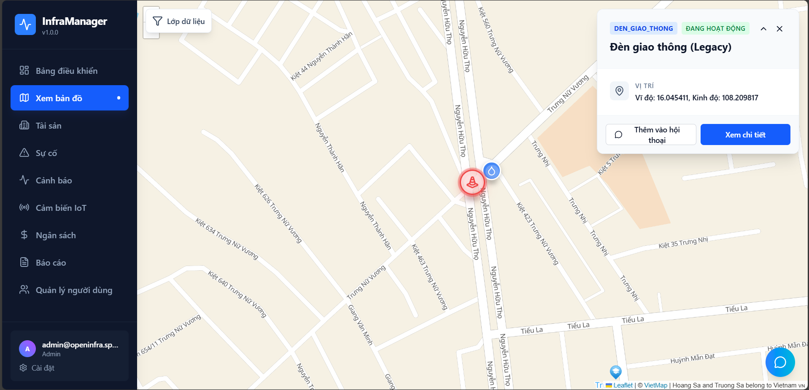
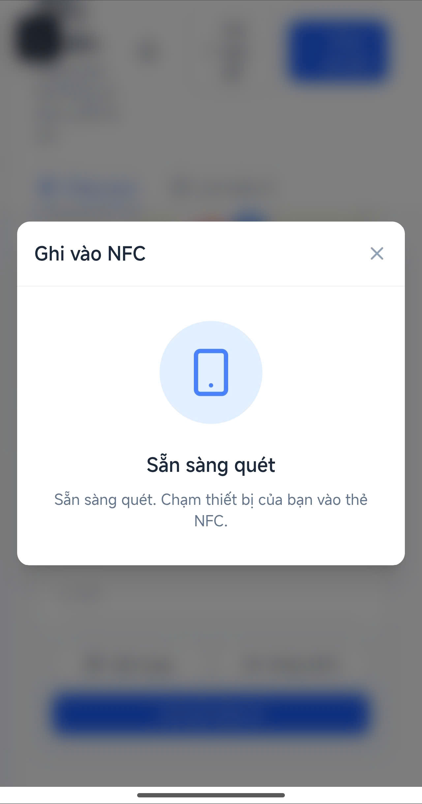
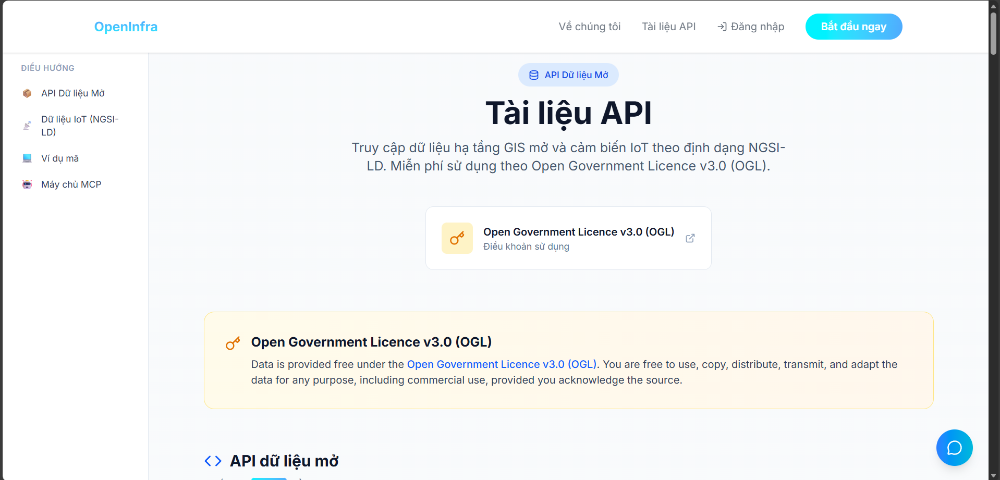

# OpenInfra - VKU.OneLove🏗️

**Urban Infrastructure Asset Management System**

[](LICENSE)
[](https://openinfra.space/)
[](https://api.openinfra.space/docs)
[](https://www.python.org/downloads/)
[](https://fastapi.tiangolo.com/)
[](https://reactjs.org/)
[](https://www.mongodb.com/)

OpenInfra is a comprehensive, production-grade urban infrastructure asset management system designed to digitize and optimize the lifecycle management of public infrastructure and telecommunications assets. Built with **Clean Architecture** principles and **Domain-Driven Design** patterns, OpenInfra empowers government agencies and utilities to track, maintain, and optimize infrastructure assets while improving service quality, extending asset lifespan, reducing operational costs, and enhancing community safety through data-driven decision making.

---

## 📋 Table of Contents

- [Overview](#-overview)
- [App Demo](#-app-demo)
- [Key Features](#-key-features)
- [Technology Stack](#-technology-stack)
- [Architecture](#-architecture)
- [Getting Started](#-getting-started)
  - [Prerequisites](#prerequisites)
  - [Installation](#installation)
  - [Configuration](#configuration)
  - [Running the Application](#running-the-application)
- [Documentation](#-documentation)
- [AI Integration & MCP Server](#-ai-integration--mcp-server)
- [User Roles](#-user-roles)
- [API Documentation](#-api-documentation)
- [Deployment](#-deployment)
- [Data Sources](#-data-sources)
- [Contributing](#-contributing)
- [License](#-license)
- [Acknowledgments](#-acknowledgments)

---

## 🎯 Overview


OpenInfra addresses the critical need for modern infrastructure management by providing a unified platform that combines:

- **Complete Asset Lifecycle Management**: Track assets from installation to retirement with comprehensive audit trails
- **Real-time IoT Monitoring**: Monitor infrastructure health with sensor data, automated alerts, and predictive maintenance
- **GIS Integration**: Visualize and query assets on interactive maps with geospatial analytics
- **Maintenance Optimization**: Schedule preventive maintenance, track work orders, and optimize resource allocation
- **Citizen Engagement**: Enable public reporting through QR/NFC codes and mobile-friendly interfaces
- **Data-driven Decisions**: Generate insights through analytics, reporting, and AI-powered recommendations

The system is architected for **production-scale deployments**, handling millions of assets, thousands of concurrent users, and high-frequency IoT data ingestion while maintaining sub-200ms API response times and 99.9%+ uptime.

### Why OpenInfra?

Traditional infrastructure management relies on paper-based records, disconnected systems, and reactive maintenance. OpenInfra transforms this by:

- **Digitizing** all asset information in a centralized, searchable database
- **Automating** monitoring and alerting through IoT sensors
- **Optimizing** maintenance schedules based on real-time data and predictive analytics
- **Engaging** citizens through transparent, accessible public interfaces
- **Enabling** AI-powered insights through semantic APIs and MCP integration

For detailed architecture information, see [Architecture Documentation](backend/docs/architecture.md).

---

## 📸 App Demo

### Homepage


### Dashboard


### GIS Map


### Asset Lifecycle Management


### Incident Management


### QR/NFC Field Access


### OpenAPI Documentation


---

## ✨ Key Features

### 1. 🗺️ Interactive GIS Mapping


- **Multi-layer Visualization**: Display BTS stations, signal strength (RSRP, SINR), and coverage anomalies
- **Geospatial Queries**: Find assets by location, radius, or custom polygons
- **Real-time Updates**: View live asset status and sensor readings
- **Coverage Analysis**: Automatically detect and alert on signal coverage issues
- **Population-weighted Prioritization**: Focus on high-impact areas

### 2. 📦 Complete Asset Lifecycle Management


- **Comprehensive Asset Profiles**: Track manufacturer, model, installation date, specifications
- **Maintenance History**: Complete audit trail of all maintenance and repairs
- **Incident Tracking**: Record and manage infrastructure issues
- **Preventive Maintenance Scheduling**: Automated reminders and planning
- **Document Management**: Store drawings, manuals, and contracts
- **Advanced Search & Reporting**: Filter, export, and analyze asset data

### 3. 📱 Field Access via QR/NFC


- **Quick Scanning**: Access asset information instantly in the field
- **Public Information**: Citizens can view basic asset details
- **Citizen Reporting**: Report issues with photos directly from scanned assets
- **Technician Access**: Field workers get full maintenance information
- **Offline Support**: Basic information available without connectivity

### 4. 🔔 Real-time IoT Monitoring & Alerts


- **Multi-sensor Support**: Temperature, tilt, door sensors, voltage, UPS, A/C monitoring
- **Threshold-based Alerts**: Automatic warnings when readings exceed limits
- **24/7 Monitoring Dashboard**: Real-time overview of all sensors and alerts
- **Automatic Ticket Generation**: Create maintenance tasks from critical alerts
- **Historical Analytics**: Trend analysis and predictive maintenance

### 5. 📡 Intelligent Coverage Monitoring

- **Automatic Anomaly Detection**: Identify areas with degraded RSRP/SINR signals
- **Citizen Feedback Integration**: Incorporate user reports into analysis
- **Population Density Weighting**: Prioritize high-impact areas
- **Nearby Station Identification**: Find relevant infrastructure for troubleshooting
- **Alert Management**: Proactive notifications for coverage issues

### 6. 🔧 Maintenance Management


- **Work Order System**: Create, assign, and track maintenance tasks
- **Technician Assignment**: Route tasks to appropriate field workers
- **Mobile-friendly Interface**: Optimized for field use
- **Cost Tracking**: Record labor, parts, and total expenses
- **Quality Assurance**: Approval workflows and verification
- **Recurring Maintenance**: Automated scheduling for preventive tasks

### 7. 🤖 AI-Ready API (MCP - Model Context Protocol)


- **Semantic API**: NGSI-LD format for IoT data interoperability
- **MCP Integration**: Simplified AI agent interaction with self-documenting APIs
- **Automatic Authentication**: Built-in security for AI systems
- **Dual Format**: Standard JSON (`/api/v1/iot`) + NGSI-LD (`/api/v1/ld`)

For detailed information about AI integration, see [AI Agent Documentation](docs/ai-agent-prompt.md) and [MCP Server Documentation](docs/mcp-server.md).

---

## 🛠️ Technology Stack

### Backend

- **Framework**: FastAPI (Python 3.11+)
- **Database**: MongoDB 7.0+ (geospatial, time-series)
- **Cache**: Redis 7.0+
- **Task Queue**: Celery + Redis
- **IoT Gateway**: MQTT (Mosquitto)
- **Storage**: MinIO (S3-compatible object storage)
- **Authentication**: JWT with RBAC

### Frontend

- **Framework**: React 18+ with TypeScript
- **Routing**: TanStack Router
- **State Management**: Zustand + TanStack Query
- **UI Components**: shadcn/ui + Tailwind CSS
- **Maps**: Leaflet + OpenStreetMap
- **Forms**: React Hook Form + Zod validation

### DevOps & Infrastructure

- **Containerization**: Docker + Docker Compose
- **Orchestration**: Kubernetes (production)
- **CI/CD**: GitHub Actions
- **Cloud Platform**: Google Cloud Platform (GCP)
- **Monitoring**: Prometheus + Grafana
- **Logging**: ELK Stack (Elasticsearch, Logstash, Kibana)
- **Tracing**: OpenTelemetry + Jaeger

For detailed technology stack information, see:
- [Backend Architecture](backend/docs/architecture.md)
- [Frontend Tech Stack](frontend/TECH_STACK_SUMMARY.md)
- [API Design](backend/docs/api-design.md)

---

## 🏗️ Architecture

OpenInfra follows **Clean Architecture** principles with clear separation of concerns:

```
┌─────────────────────────────────────────────────────────────┐
│                    Client Layer (React)                     │
└────────────────────────┬────────────────────────────────────┘
                         │
                         ▼
┌─────────────────────────────────────────────────────────────┐
│              API Layer (FastAPI Routers)                    │
│  • Authentication & Authorization (JWT + RBAC)              │
│  • Request Validation (Pydantic)                            │
│  • Rate Limiting & CORS                                     │
└────────────────────────┬────────────────────────────────────┘
                         │
                         ▼
┌─────────────────────────────────────────────────────────────┐
│               Domain Layer (Business Logic)                 │
│  • Services: Asset, Maintenance, IoT, Alert                 │
│  • Models: Domain entities with business rules              │
│  • Repositories: Abstract data access interfaces            │
└────────────────────────┬────────────────────────────────────┘
                         │
                         ▼
┌─────────────────────────────────────────────────────────────┐
│           Infrastructure Layer (Implementations)            │
│  • MongoDB (with Motor async driver)                        │
│  • Redis (caching & pub/sub)                                │
│  • Celery (background tasks)                                │
│  • MQTT (IoT data ingestion)                                │
│  • MinIO (object storage)                                   │
│  • External APIs (OSM, email, SMS)                          │
└─────────────────────────────────────────────────────────────┘
```

**Key Architecture Benefits**:
- ✅ **Testable**: Business logic independent of frameworks
- ✅ **Maintainable**: Clear boundaries between layers
- ✅ **Scalable**: Horizontal scaling of all components
- ✅ **Flexible**: Easy to swap infrastructure components

For comprehensive architecture documentation, see:
- [System Architecture](backend/docs/architecture.md)
- [Database Design](backend/docs/database-design.md)
- [API Design](backend/docs/api-design.md)
- [Project Plan](backend/docs/project-plan.md)

---

## 🚀 Getting Started

### Prerequisites

- **Python 3.11+** - [Download](https://www.python.org/downloads/)
- **Node.js 18+** - [Download](https://nodejs.org/)
- **Docker & Docker Compose** - [Download](https://www.docker.com/get-started)
- **Git** - [Download](https://git-scm.com/)

### Installation

1. **Clone the repository**

```bash
git clone https://github.com/vku-open-source-2025/openinfra.git
cd openinfra
```

2. **Start infrastructure services**

```bash
cd infra
docker-compose up -d
```

This starts:
- MongoDB (port 27017)
- Redis (port 6379)
- MQTT Broker (port 1883)

3. **Setup Backend**

```bash
cd backend

# Create virtual environment
python -m venv venv
source venv/bin/activate  # On Windows: venv\Scripts\activate

# Install dependencies
pip install -r requirements.txt

# Copy and configure environment file
cp .env.example .env
# Edit .env with your settings (see Configuration section)
```

4. **Initialize Database**

```bash
# Create database structure and indexes
python scripts/init_db.py

# Create admin superuser
python scripts/create_superuser.py
```

5. **Setup Frontend**

```bash
cd frontend

# Install dependencies
npm install

# Copy and configure environment file
cp .env.example .env
# Edit .env with backend API URL
```

### Configuration

#### Backend Configuration (`.env`)

```bash
# Application
PROJECT_NAME=OpenInfra
ENVIRONMENT=development
DEBUG=true
LOG_LEVEL=debug

# Database
MONGODB_URL=mongodb://localhost:27017
DATABASE_NAME=openinfra_dev

# Redis
REDIS_URL=redis://localhost:6379/0

# Security
SECRET_KEY=your-secret-key-change-in-production
JWT_SECRET_KEY=your-jwt-secret-key-change-in-production
JWT_ALGORITHM=HS256
JWT_EXPIRATION_MINUTES=60

# Admin Account (for create_superuser.py)
ADMIN_DEFAULT_USERNAME=admin
ADMIN_DEFAULT_PASSWORD=change-this-strong-password

# External Services (Optional)
OSM_NOMINATIM_URL=https://nominatim.openstreetmap.org
SENDGRID_API_KEY=your-sendgrid-api-key
TWILIO_ACCOUNT_SID=your-twilio-sid
TWILIO_AUTH_TOKEN=your-twilio-token

# Storage (local for development, minio for production)
STORAGE_BACKEND=local
# For MinIO:
# STORAGE_BACKEND=minio
# MINIO_ENDPOINT=localhost:9000
# MINIO_ACCESS_KEY=minioadmin
# MINIO_SECRET_KEY=minioadmin
# MINIO_BUCKET_NAME=openinfra-assets
# MINIO_USE_SSL=false

# MQTT
MQTT_BROKER_HOST=localhost
MQTT_BROKER_PORT=1883
MQTT_USERNAME=openinfra
MQTT_PASSWORD=change-this

# Celery
CELERY_BROKER_URL=redis://localhost:6379/1
CELERY_RESULT_BACKEND=redis://localhost:6379/2
```

#### Frontend Configuration (`.env`)

```bash
VITE_BASE_API_URL=http://localhost:8000
VITE_LEADERBOARD_URL=http://localhost:8000
```

### Running the Application

#### Backend Services

Open **3 separate terminals** for backend services:

**Terminal 1 - API Server:**
```bash
cd backend
source venv/bin/activate
uvicorn app.main:app --reload --host 0.0.0.0 --port 8000
```

**Terminal 2 - Celery Worker (Background Tasks):**
```bash
cd backend
source venv/bin/activate
celery -A app.celery_app worker --loglevel=info
```

**Terminal 3 - Celery Beat (Task Scheduler):**
```bash
cd backend
source venv/bin/activate
celery -A app.celery_app beat --loglevel=info
```

For more information about Celery, see [Celery CLI Documentation](backend/scripts/CELERY_CLI.md).

#### Frontend

```bash
cd frontend
npm run dev
```

### Access the Application

- **Frontend**: http://localhost:5173
- **Backend API**: http://localhost:8000
- **API Documentation (Swagger)**: http://localhost:8000/docs
- **API Documentation (ReDoc)**: http://localhost:8000/redoc

### Default Admin Login

- **Login URL**: http://localhost:5173/admin/login
- **Username**: Set in `.env` (`ADMIN_DEFAULT_USERNAME`)
- **Password**: Set in `.env` (`ADMIN_DEFAULT_PASSWORD`)

**⚠️ Security Note**: Change the default credentials in `.env` before running `create_superuser.py`. Never use example credentials in production.

For additional setup information, see:
- [Infrastructure Setup](infra/README.md)
- [Data Seeding Guide](infra/DATA_SEEDING.md)
- [Frontend Quick Start](frontend/QUICK_START.md)

---

## 📚 Documentation

OpenInfra provides comprehensive documentation across multiple areas:

### Core Documentation

- **[System Architecture](backend/docs/architecture.md)** - Detailed architecture overview, design principles, and system structure
- **[Database Design](backend/docs/database-design.md)** - Database schema, indexes, and data modeling decisions
- **[API Design](backend/docs/api-design.md)** - API conventions, versioning, and design patterns
- **[Project Plan](backend/docs/project-plan.md)** - Development roadmap and implementation phases
- **[Deployment Guide](backend/docs/deployment.md)** - Production deployment strategies and best practices

### AI & Integration Documentation

- **[AI Agent Prompt](docs/ai-agent-prompt.md)** - Guide for AI assistants interacting with OpenInfra
- **[MCP Server Documentation](docs/mcp-server.md)** - Model Context Protocol server setup and usage

### API Documentation

- **[Complete API Reference](backend/docs/API_DOCUMENTATION.md)** - Full API endpoint documentation
- **[Interactive API Docs](https://api.openinfra.space/docs)** - Live Swagger UI documentation

### Frontend Documentation

- **[Frontend Architecture](frontend/docs/architecture.md)** - React application structure and patterns
- **[Frontend Tech Stack](frontend/TECH_STACK_SUMMARY.md)** - Technology choices and rationale
- **[Feature Flow Summary](frontend/docs/FEATURE_FLOW_SUMMARY.md)** - User flow documentation
- **[API Endpoints Summary](frontend/docs/API_ENDPOINTS_SUMMARY.md)** - Frontend API integration guide

### Development Documentation

- **[Contributing Guide](CONTRIBUTING.md)** - How to contribute to the project
- **[Code of Conduct](CODE_OF_CONDUCT.md)** - Community guidelines
- **[Security Policy](SECURITY.md)** - Security reporting and best practices
- **[Implementation Status](IMPLEMENTATION_STATUS.md)** - Current development status

### Infrastructure Documentation

- **[Infrastructure Setup](infra/README.md)** - Docker Compose and infrastructure services
- **[Data Seeding](infra/DATA_SEEDING.md)** - How to seed test data
- **[Celery CLI](backend/scripts/CELERY_CLI.md)** - Background task management

---

## 🤖 AI Integration & MCP Server

OpenInfra provides advanced AI integration capabilities through the **Model Context Protocol (MCP)**, enabling AI assistants to interact with infrastructure data seamlessly.

### MCP Server

The OpenInfra MCP server exposes **Open Data API documentation** to AI assistants, providing read-only access to publicly accessible endpoints.

**Connection Details:**
- **Server URL**: `https://mcp.openinfra.space/sse`
- **Transport**: SSE (Server-Sent Events)
- **Protocol**: MCP 2.0+

**Available Tools:**
- `get_opendata_endpoints` - List all public Open Data API endpoints
- `get_opendata_docs` - Detailed Open Data API documentation
- `get_iot_docs` - IoT Sensors API documentation

### Client Configuration

**Claude Desktop** (`claude_desktop_config.json`):
```json
{
  "mcpServers": {
    "openinfra": {
      "url": "https://mcp.openinfra.space/sse"
    }
  }
}
```

**GitHub Copilot** (VS Code `settings.json`):
```json
{
  "github.copilot.chat.mcpServers": {
    "openinfra": {
      "url": "https://mcp.openinfra.space/sse"
    }
  }
}
```

**Cursor** (MCP configuration):
```json
{
  "mcpServers": {
    "openinfra": {
      "url": "https://mcp.openinfra.space/sse"
    }
  }
}
```

### AI Agent Capabilities

Once connected, AI assistants can:
- Query infrastructure assets and their specifications
- Retrieve IoT sensor data and readings
- Access public Open Data endpoints
- Provide code examples for API integration
- Explain OpenInfra system architecture

For detailed information, see:
- **[MCP Server Documentation](docs/mcp-server.md)** - Complete MCP setup guide
- **[AI Agent Prompt](docs/ai-agent-prompt.md)** - AI assistant capabilities and guidelines

---

## 👥 User Roles

### 🔑 Administrator
**Full system access and management**

- Manage all assets and infrastructure
- Create and assign maintenance work orders
- Monitor system-wide status and alerts
- Generate reports and analytics
- Manage user accounts and permissions

### 🔧 Technician
**Field operations and maintenance**

- View assigned assets and locations
- Receive and update maintenance tasks
- Report incidents and issues
- Upload photos and documentation
- Update asset status in the field
- Access mobile-optimized interface

### 👨‍👩‍👧‍👦 Citizen (Public)
**Information access and issue reporting**

- View public asset information via QR/NFC
- Report infrastructure issues with photos
- Track submitted incident reports
- View basic infrastructure status
- **Restricted**: Cannot modify any data

---

## 📚 API Documentation

### Interactive Documentation

- **Swagger UI**: http://localhost:8000/docs
- **ReDoc**: http://localhost:8000/redoc
- **Production API**: https://api.openinfra.space/docs

### API Versioning

All endpoints are versioned: `/api/v1/...`

### Authentication

Most endpoints require JWT authentication:

```bash
# Login to get token
POST /api/v1/auth/login
{
  "username": "your_username",
  "password": "your_password"
}

# Use token in subsequent requests
Authorization: Bearer <your_jwt_token>
```

### Key Endpoints

```
Authentication
  POST   /api/v1/auth/login              # Login
  POST   /api/v1/auth/register           # Register
  POST   /api/v1/auth/refresh            # Refresh token

Assets
  GET    /api/v1/assets                  # List assets (paginated)
  POST   /api/v1/assets                  # Create asset
  GET    /api/v1/assets/{id}             # Get asset details
  PUT    /api/v1/assets/{id}             # Update asset
  DELETE /api/v1/assets/{id}             # Delete asset
  GET    /api/v1/assets/nearby           # Find nearby assets
  GET    /api/v1/assets/{id}/history     # Asset change history

Maintenance
  GET    /api/v1/maintenance             # List work orders
  POST   /api/v1/maintenance             # Create work order
  GET    /api/v1/maintenance/{id}        # Get work order
  PUT    /api/v1/maintenance/{id}        # Update work order
  POST   /api/v1/maintenance/{id}/assign # Assign to technician

Incidents
  GET    /api/v1/incidents               # List incidents
  POST   /api/v1/incidents               # Report incident
  GET    /api/v1/incidents/{id}          # Get incident details
  PUT    /api/v1/incidents/{id}          # Update incident

IoT Sensors
  GET    /api/v1/iot/sensors             # List sensors
  POST   /api/v1/iot/sensors             # Register sensor
  GET    /api/v1/iot/sensors/{id}/data   # Get sensor readings
  POST   /api/v1/iot/sensors/{id}/data   # Ingest reading (API key)

Alerts
  GET    /api/v1/alerts                  # List alerts
  POST   /api/v1/alerts/{id}/acknowledge # Acknowledge alert
  POST   /api/v1/alerts/{id}/resolve     # Resolve alert

Public Access (No Authentication)
  GET    /api/v1/public/assets/{code}    # Get asset by QR/NFC code
  POST   /api/v1/public/incidents        # Anonymous incident reporting
```

For complete API documentation, see:
- **[API Documentation](backend/docs/API_DOCUMENTATION.md)** - Complete endpoint reference
- **[API Design Guide](backend/docs/api-design.md)** - API design principles and patterns

---

## 🚢 Deployment

### Development Environment

Use Docker Compose (already running from setup):

```bash
cd infra
docker-compose up -d
```

### Production Deployment

OpenInfra supports multiple deployment strategies:

#### 1. Docker Compose (Small/Medium Deployments)

```bash
# Production Docker Compose
docker-compose -f docker-compose.prod.yml up -d
```

#### 2. Kubernetes (Large Scale/Enterprise)

```bash
# Deploy to Kubernetes
kubectl apply -f k8s/
```

**Production Features**:
- Horizontal Pod Autoscaling
- Load balancing
- Health checks
- Rolling updates
- Secret management
- TLS/SSL certificates

#### 3. Cloud Platforms

**Recommended**: Google Cloud Platform (GKE)
- Managed Kubernetes
- MongoDB Atlas (managed database)
- Cloud Storage for files
- Cloud Monitoring & Logging

For detailed deployment instructions, see:
- **[Deployment Guide](backend/docs/deployment.md)** - Comprehensive deployment documentation
- **[Production Readiness Checklist](PRODUCTION_READINESS_CHECKLIST.md)** - Production deployment checklist
---


## 🤝 Contributing

We welcome contributions from the community! Here's how you can help:

### Ways to Contribute

- 🐛 **Report bugs** via [GitHub Issues](https://github.com/vku-open-source-2025/openinfra/issues)
- 💡 **Suggest features** via [GitHub Discussions](https://github.com/vku-open-source-2025/openinfra/discussions)
- 📝 **Improve documentation**
- 🔧 **Submit pull requests**

### Development Workflow

1. **Fork the repository**
2. **Create a feature branch**: `git checkout -b feature/amazing-feature`
3. **Make your changes**
4. **Add tests** for new functionality
5. **Ensure tests pass**: `pytest` (backend), `npm test` (frontend)
6. **Commit with clear messages**: `git commit -m "feat: add amazing feature"`
7. **Push to your fork**: `git push origin feature/amazing-feature`
8. **Open a Pull Request**

### Code Style

**Backend (Python)**:
- Follow PEP 8
- Use Black for formatting
- Use type hints
- Write docstrings (Google style)

**Frontend (TypeScript)**:
- Use ESLint + Prettier
- Follow React best practices
- Write clear component documentation

### Running Tests

**Backend:**
```bash
cd backend
pytest --cov=app --cov-report=html
```

**Frontend:**
```bash
cd frontend
npm test
npm run test:e2e
```

For more information, see:
- **[Contributing Guide](CONTRIBUTING.md)** - Detailed contribution guidelines
- **[Code of Conduct](CODE_OF_CONDUCT.md)** - Community standards

---

## 📄 License

### Code License
This project is licensed under the Apache License 2.0 - see the [LICENSE](LICENSE) file for details.

### Data License - Open Government Licence (OGL) v3.0

OpenInfra makes public infrastructure data available under the **Open Government Licence v3.0 (OGL)**. This license is designed for government and public sector data, allowing free use and reuse of data while maintaining appropriate attribution.

#### What is OGL?

The Open Government Licence (OGL) is a free, open license for government and public sector information. Version 3.0 is maintained by The National Archives (UK) and is widely used internationally for open data initiatives.

#### Key Features of OGL v3.0

**You are free to:**
- ✅ **Copy, publish, distribute and transmit** the data
- ✅ **Adapt the data** and create derivative works
- ✅ **Use the data commercially** and non-commercially
- ✅ **Combine the data** with other datasets

**Under the following conditions:**
- 📋 **Attribution**: You must acknowledge the source of the data
- 📋 **License Notice**: You must include the OGL license notice
- 📋 **No Misrepresentation**: You must not mislead others or misrepresent the data or its source

#### What Data is Licensed Under OGL?

The following data types in OpenInfra are available under OGL:

- **Public Infrastructure Assets**: Location, type, specifications, and public status
- **Aggregated Maintenance Statistics**: Summary maintenance data (not detailed personal records)
- **Public Incident Reports**: Citizen-reported issues (with privacy filters applied)
- **Geospatial Data**: Asset coordinates and location information
- **Public API Data**: Data accessible through `/api/v1/public/*` endpoints

#### What Data is NOT Licensed Under OGL?

The following data types are **NOT** subject to open licensing:

- ❌ **Personal Identifiable Information (PII)**: User accounts, emails, phone numbers
- ❌ **Detailed Financial Data**: Individual transactions, vendor information
- ❌ **Sensitive Operational Data**: Security information, detailed audit logs
- ❌ **Private User Data**: Personal preferences, private incident details

#### Attribution Requirements

When using OGL-licensed data, you must include attribution such as:

```
Data source: OpenInfra (https://openinfra.space) - Licensed under Open Government Licence v3.0
```

Or in API responses:
```json
{
  "license": "OGL",
  "license_url": "https://www.nationalarchives.gov.uk/doc/open-government-licence/version/3/",
  "attribution": "Data provided by OpenInfra (https://openinfra.space). Licensed under OGL."
}
```

#### Full License Text

For the complete OGL v3.0 license text, visit:
**https://www.nationalarchives.gov.uk/doc/open-government-licence/version/3/**

#### API Access

OGL-licensed data is available through:
- **Public API Endpoints**: `/api/v1/public/*`
- **Open Data API**: `/api/v1/opendata/*`
- **License Information**: `/api/v1/opendata/license`

For more information about data licensing, see [Data License Documentation](frontend/docs/DATA_LICENSE_RECOMMENDATION.md).

---

## 🙏 Acknowledgments

- **VKU.OneLove** - Development Team
- **OpenStreetMap** - Geospatial data and mapping services
- **FastAPI** - Modern, fast web framework
- **MongoDB** - Flexible, scalable database
- **React Community** - Frontend ecosystem
- **shadcn/ui** - Beautiful UI components
- **Font Awesome** - Icons by Font Awesome (https://fontawesome.com) licensed under [CC BY 4.0](https://creativecommons.org/licenses/by/4.0/)
- **Vietnamese Telecom Providers** - Infrastructure data sources
- All open-source contributors

---

## 📞 Support & Contact

- **Cloud Service**: [https://openinfra.space](https://openinfra.space/)
- **Open API Documentation**: [https://api.openinfra.space/docs](https://api.openinfra.space/docs)
- **Documentation**: [backend/docs/](backend/docs/)
- **Issues**: [GitHub Issues](https://github.com/vku-open-source-2025/openinfra/issues)
- **Discussions**: [GitHub Discussions](https://github.com/vku-open-source-2025/openinfra/discussions)

---

## 🗺️ Project Roadmap

### Completed ✅
- Core authentication and authorization
- Basic asset management
- GIS integration
- IoT sensor monitoring
- Real-time alerts
- MCP server for AI integration

### In Progress 🚧
- Advanced coverage analysis
- Predictive maintenance
- Mobile app for technicians
- Advanced reporting

### Planned 🔮
- Machine learning for anomaly detection
- 5G network optimization
- Multi-city deployment
- Public API marketplace
- Integration with government systems

For current implementation status, see [Implementation Status](IMPLEMENTATION_STATUS.md).

---

## 📈 Performance & Scale

OpenInfra is designed to handle city-scale deployments:

- **Assets**: 1,000,000+ infrastructure items
- **Concurrent Users**: 10,000+ simultaneous users
- **Sensor Data**: 10,000 messages/second ingestion
- **API Response**: < 200ms (p95)
- **Uptime**: > 99.9% availability

---

## 🎓 Learn More

### Architecture & Design
- **[Architecture Guide](backend/docs/architecture.md)** - System architecture and design principles
- **[Database Design](backend/docs/database-design.md)** - Database schema and modeling
- **[API Design](backend/docs/api-design.md)** - API conventions and patterns

### Development
- **[Project Plan](backend/docs/project-plan.md)** - Development roadmap
- **[Deployment Guide](backend/docs/deployment.md)** - Deployment strategies
- **[Implementation Status](IMPLEMENTATION_STATUS.md)** - Current development status

### AI & Integration
- **[AI Agent Documentation](docs/ai-agent-prompt.md)** - AI assistant integration
- **[MCP Server Documentation](docs/mcp-server.md)** - Model Context Protocol setup

---

<div align="center">

**Built with ❤️ for better urban infrastructure management**

[⭐ Star us on GitHub](https://github.com/vku-open-source-2025/openinfra) | [🐛 Report Bug](https://github.com/vku-open-source-2025/openinfra/issues) | [💡 Request Feature](https://github.com/vku-open-source-2025/openinfra/issues)

</div>
